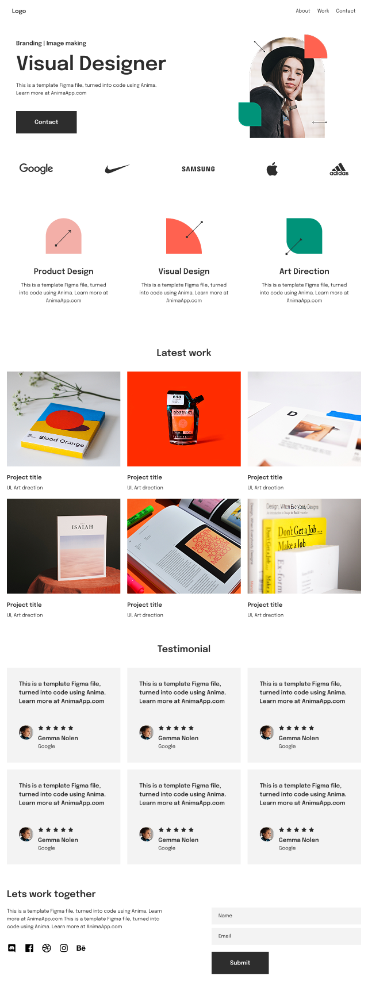

# Portfolio App

This project was built by initializing a blank Next.js 16 app router application, then transforming a Figma design into code using the <a href="https://developers.figma.com/docs/figma-mcp-server/local-server-installation/" target="_blank" rel="noopener noreferrer">Figma MCP server</a>.

The Figma design used for this project is a free community artifact provided by <a href="https://www.figma.com/community/file/1095695980466714349" target="_blank" rel="noopener noreferrer">Anima</a>.

## See Runing App on Vercel
TODO: add vercel link

## Design Preview



## Tech Stack

- Next.js 16 (App Router)
- React
- TypeScript
- Tailwind CSS
- shadcn/ui components

## Getting Started

First, run the development server:

```bash
pnpm dev
```

Open [http://localhost:3000](http://localhost:3000) with your browser to see the result.
